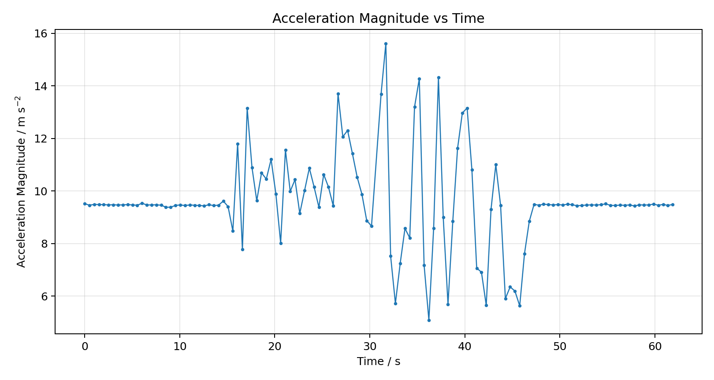
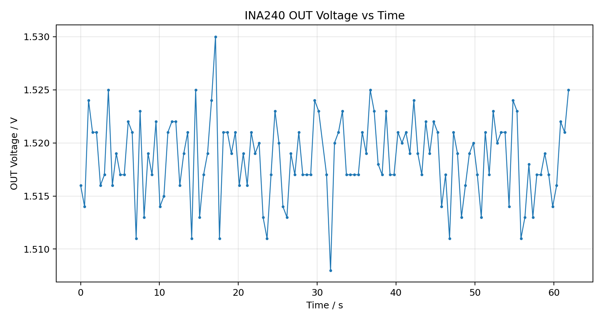

# ESP32-Based Drone Telemetry and Sensor Monitoring Prototype

## Overview

This repository presents a first embedded-systems prototype for drone telemetry and sensor monitoring. The system uses an **ESP32-WROOM-32** to collect motion data from an **MPU6050 IMU** and analog sensor output from an **INA240 current sensor**. The final integrated program outputs timestamped telemetry data in CSV format for analysis and visualization.

The project was developed as a practical Electrical and Electronic Engineering exploration. It documents the full engineering process: problem identification, sensor testing, circuit debugging, data collection, graphing, and reflection on limitations.

## Motivation

The project was inspired by a drone competition in Singapore. The drone operated inside an arena covered by a large net, and the pilot position was far from the take-off area. This made it difficult to observe real-time flight state. The drone also ran out of battery unexpectedly during the competition.

This led to the central engineering question:

> How can a low-cost telemetry system improve battery awareness and flight-state visibility for drones in obstructed racing environments?

## What I Built

The final MVP integrates:

- **ESP32-WROOM-32** as the main microcontroller
- **MPU6050** for acceleration and gyroscope readings
- **INA240** for analog current-sensor output monitoring
- **Serial CSV telemetry output** for saving and analyzing data
- **Excel-based graphs** showing motion state and sensor-output stability

This is not yet a complete drone battery-management system. It is a working prototype that demonstrates how multiple low-cost sensors can be integrated into one telemetry stream.

## Hardware

| Component | Role |
|---|---|
| ESP32-WROOM-32 | Main controller and data output |
| MPU6050 | IMU motion sensing |
| INA240 analog current sensor | Analog current-sensor output monitoring |
| Breadboard and jumper wires | Circuit prototyping |
| 4×AA battery holder | Safe low-voltage load testing |
| LED and resistor | Low-current test load |
| Arduino IDE | Programming and serial monitoring |

## System Architecture

### MPU6050 IMU

The MPU6050 is connected through I2C.

| MPU6050 | ESP32 |
|---|---|
| VCC | 3V3 |
| GND | GND |
| SDA | GPIO21 |
| SCL | GPIO22 |

### INA240 Analog Sensor Output

The INA240 is read through an ESP32 ADC pin.

| INA240 | ESP32 |
|---|---|
| VCC | 3V3 |
| GND | GND |
| OUT | GPIO34 |

## Final CSV Output

The final integrated telemetry program outputs:

```csv
time_ms,accel_x,accel_y,accel_z,gyro_x,gyro_y,gyro_z,accel_magnitude,ina240_adc,ina240_out_voltage
```

The acceleration magnitude is calculated using:

```text
accel_magnitude = sqrt(accel_x^2 + accel_y^2 + accel_z^2)
```

## Results

### 1. Motion-State Monitoring

The integrated 60-second test showed a clear difference between stationary and movement phases. During the stationary phases, the acceleration magnitude stayed close to approximately **9.5 m s^-2**. During manual movement, the acceleration magnitude fluctuated between approximately **5.1 and 15.6 m s^-2**.



This shows that the MPU6050 can detect changes in motion state and that the ESP32 can record those changes as telemetry data.

### 2. INA240 Analog Output Monitoring

The INA240 output voltage remained approximately between **1.508 V and 1.530 V** during the integrated test.



This shows that the ESP32 ADC can stably acquire the INA240 analog output while simultaneously reading IMU data.

## Engineering Challenges

A key challenge was debugging the low-voltage LED load circuit. During an early attempt, the battery-holder wire heated up, indicating a likely short circuit caused by an incorrect breadboard connection. The circuit was immediately disconnected, checked, and rebuilt with the LED and resistor properly connected in series.

This was an important part of the project because it required real circuit troubleshooting rather than only software testing.

## Limitations

- The INA240 output was not calibrated with a known current load.
- The INA240 data currently represents analog output voltage, not accurate current in amperes.
- The movement test was performed manually, so the motion profile is not perfectly repeatable.
- The system was tested with a safe low-voltage circuit rather than a real drone battery.
- The OLED display was detected but did not display correctly, so it was postponed.
- The current prototype uses Serial Monitor output rather than wireless telemetry.

## Future Work

- Calibrate INA240 using known resistive loads
- Add battery voltage sensing
- Convert analog output into estimated current after calibration
- Add warning logic for low battery or abnormal movement
- Build a simple web dashboard using ESP32 Wi-Fi
- Add wireless telemetry through Wi-Fi or Bluetooth
- Test on a safe drone platform without propellers

## Repository Structure

```text
drone-telemetry-sensor-monitoring/
├── README.md
├── project_summary.md
├── project_log.md
├── arduino/
├── data/
├── figures/
├── docs/
└── media/
```

## Current Status

The technical MVP is complete:

- ESP32 serial test completed
- MPU6050 detected and tested
- MPU6050 CSV motion output completed
- INA240 analog output tested through ESP32 GPIO34
- Low-voltage LED load test completed after circuit debugging
- Integrated MPU6050 + INA240 telemetry system completed
- 60-second integrated dataset collected
- Result graphs generated

The next stage is calibration, wireless telemetry, and improved dashboard/display output.
